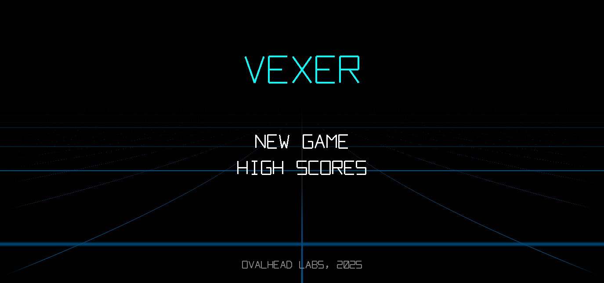

# Vexer

A fast-paced arcade game built with Godot 4.5 featuring vector graphics and gravity-defying gameplay.

**Developer:** Ovalhead Labs, 2025



## Overview

Vexer is a physics-based arcade game where players draw lines to keep bouncing balls in play while collecting bonus shapes for points. The game features a retro vector aesthetic inspired by classic arcade games like Tempest.

## Visual Style

- **Vector Graphics:** All visuals are drawn with lines and hollow shapes—no bitmaps or filled polygons
- **Color Scheme:**
  - Player line: Green
  - Balls: Red with trailing afterimages
  - Bonus shapes: Randomized colors (cyan, magenta, yellow, orange, purple, etc.)
  - Background: Black
- **Effects:** Tracer trails, explosion particles, edge glows, and screen flash effects all follow the vector aesthetic
- **Typography:** Custom Tempest-style vector font for all text display

## Gameplay

### Core Mechanics

Players control a line by clicking/touching a start point and dragging to create a deflection surface. The line has a **5-second timeout** to prevent camping, displayed as a centered countdown that changes color (green → yellow → red).

Balls spawn from the edge opposite to gravity and fall toward the exit edge. Players must keep balls in play by deflecting them with their line. Each ball scores points over time based on how long it remains in play.

### Bonus Shapes

Spinning geometric shapes (triangles to hexagons) appear periodically:
- Shapes have physics collision—balls bounce off their edges
- Hitting a shape awards points based on size (smaller = more points: 50-250)
- Hitting a shape removes one random ball from play (minimum 1 ball remains)
- Shapes explode into colorful fragments when hit
- 1-5 shapes can be on screen simultaneously

### Scoring & Game Over

- Points accumulate while balls are in play (10 points per ball per second)
- Losing a ball deducts 50 points and triggers a screen flash
- All shapes explode (without points) when a ball is lost
- **Game Over:** Score remains at zero for 5+ seconds

### Gravity Rotation

Every 1000 points (configurable), gravity rotates clockwise:
1. **North → South** (balls fall down, exit bottom)
2. **East → West** (balls fall left, exit left)
3. **South → North** (balls fall up, exit top)
4. **West → East** (balls fall right, exit right)

Edge glow effects indicate ball activity:
- **Green:** Ball spawn edge
- **Red:** Ball lost edge
- **Yellow:** Wall bounce

## Difficulty Levels

| Difficulty | Gravity Changes | Ball Spawn Rate |
|------------|-----------------|-----------------|
| Easy       | None            | Slower          |
| Medium     | Up/Down only    | Normal          |
| Hard       | Full rotation   | Faster          |

## Screen Flow

### Main Menu
- Game title in large vector font
- "New Game" and "High Scores" options
- Animated 3D grid shader background (floor perspective)
- Footer: "Ovalhead Labs, 2025"

### Difficulty Selection
- Three difficulty buttons (Easy/Medium/Hard)
- Back button to return to main menu

### High Scores
- Displays top score for each difficulty level
- Shows difficulty, score, and date achieved
- Fireworks effect in background
- Back button to return to main menu

### Game Screen
- HUD with score (top-left) and gravity indicator (top-right)
- Line timeout counter (top-center, when active)
- Ball count (bottom-center)
- Responsive layout adapts to window resizing

### How To Play Screen
- Should have a few bullet points summarizing gameplay.
- No major detail (such as exact scoring or gravity direction details.)
- Just describe how the game works (time limits, game over condition, etc.)

## Technical Details

### Requirements
- Godot 4.5+
- Mobile rendering pipeline

### Project Structure

```
vexer/
├── scenes/           # Scene files (.tscn)
│   ├── main_menu.tscn
│   ├── difficulty_menu.tscn
│   ├── high_scores.tscn
│   ├── game.tscn
│   ├── ball.tscn
│   ├── bonus_shape.tscn
│   ├── player_line.tscn
│   └── hud.tscn
├── scripts/          # GDScript files (.gd)
│   ├── game_state.gd      # Autoload singleton
│   ├── vector_font.gd     # Custom font rendering
│   └── ...
├── shaders/          # Shader files (.gdshader)
│   └── grid_background.gdshader
└── resources/        # Game assets
```

### Running the Project

```bash
# Run the game
godot --path /Volumes/1tb/godot/vexer

# Open in editor
godot --path /Volumes/1tb/godot/vexer --editor
```

## Configuration

Key constants can be adjusted in `scripts/game.gd`:

| Constant | Default | Description |
|----------|---------|-------------|
| `INITIAL_SPAWN_INTERVAL` | 3.0 | Seconds between ball spawns (start) |
| `MIN_SPAWN_INTERVAL` | 0.5 | Minimum spawn interval |
| `BALL_LOST_PENALTY` | 50 | Points deducted when ball is lost |
| `gravity_rotation_threshold` | 1000 | Points needed to rotate gravity |

## License

All rights reserved. Ovalhead Labs, 2025.
